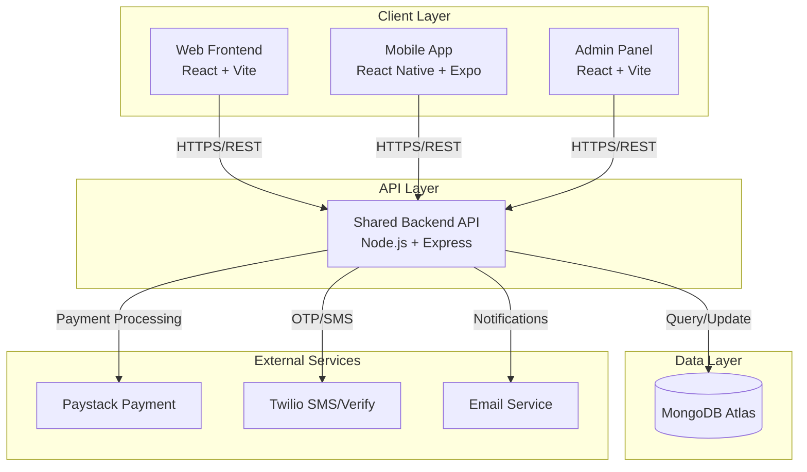

# Design Document: Ajosave Project Restructuring

## Overview

This design restructures the Ajosave multi-platform savings application to achieve absolute tidiness, enhanced security, and maintainable architecture. The system consists of a shared Node.js/Express backend API serving three client applications: a React web frontend, a React Native mobile app, and an admin web panel. The restructuring focuses on proper separation of concerns, secure configuration management, code reusability, and clear boundaries between platform-specific implementations while maintaining a unified backend architecture.

The primary goals are: (1) establish a clean, predictable directory structure across all platforms, (2) implement secure secret management with environment-based configurations, (3) separate shared business logic from platform-specific code, (4) enable independent deployment of each client while maintaining backend consistency, and (5) create clear documentation boundaries for each system component.

## Main Architecture



## Proposed Directory Structure

### Root Level Organization

```typescript
// Proposed root structure
interface ProjectStructure {
  packages: {
    backend: "Shared API server",
    web: "React web application", 
    mobile: "React Native mobile app",
    admin: "Admin panel application",
    shared: "Shared utilities and types"
  },
  docs: "Centralized documentation",
  config: "Root-level configurations",
  scripts: "Cross-project automation scripts"
}
```

```
ajosave/
├── packages/
│   ├── backend/              # Shared API server
│   ├── web/                  # React web frontend
│   ├── mobile/               # React Native mobile app
│   ├── admin/                # Admin panel
│   └── shared/               # Shared code across clients
│
├── docs/                     # Centralized documentation
│   ├── api/                  # API documentation
│   ├── architecture/         # System architecture docs
│   ├── deployment/           # Deployment guides
│   ├── features/             # Feature specifications
│   └── security/             # Security policies
│
├── config/                   # Root-level configs
│   ├── .env.template         # Template for all environments
│   ├── eslint.config.js      # Shared linting rules
│   └── tsconfig.base.json    # Base TypeScript config
│
├── scripts/                  # Cross-project scripts
│   ├── setup.js              # Initial project setup
│   ├── deploy.js             # Deployment automation
│   └── migrate.js            # Database migrations
│
├── .gitignore                # Root gitignore
├── package.json              # Root package manager
├── README.md                 # Project overview
└── LICENSE                   # Project license
```

## Backend Package Structure

### Purpose
Shared API server providing authentication, group savings, wallet management, transaction processing, and admin operations for all client applications.

### Directory Layout

```
packages/backend/
├── src/
│   ├── api/                  # API layer
│   │   ├── routes/           # Route definitions
│   │   │   ├── v1/           # API version 1
│   │   │   │   ├── auth.routes.js
│   │   │   │   ├── groups.routes.js
│   │   │   │   ├── wallet.routes.js
│   │   │   │   ├── transactions.routes.js
│   │   │   │   └── admin/    # Admin-specific routes
│   │   │   │       ├── auth.routes.js
│   │   │   │       ├── users.routes.js
│   │   │   │       ├── analytics.routes.js
│   │   │   │       └── settings.routes.js
│   │   │   └── index.js      # Route aggregator
│   │   ├── controllers/      # Request handlers
│   │   │   ├── auth.controller.js
│   │   │   ├── groups.controller.js
│   │   │   ├── wallet.controller.js
│   │   │   ├── transactions.controller.js
│   │   │   └── admin/        # Admin controllers
│   │   ├── middlewares/      # Express middlewares
│   │   │   ├── auth.middleware.js
│   │   │   ├── admin-auth.middleware.js
│   │   │   ├── validation.middleware.js
│   │   │   ├── rate-limit.middleware.js
│   │   │   ├── security.middleware.js
│   │   │   └── error.middleware.js
│   │   └── validators/       # Request validation schemas
│   │       ├── auth.validator.js
│   │       ├── group.validator.js
│   │       └── transaction.validator.js
│   │
│   ├── core/                 # Business logic layer
│   │   ├── services/         # Business services
│   │   │   ├── auth.service.js
│   │   │   ├── group.service.js
│   │   │   ├── wallet.service.js
│   │   │   ├── transaction.service.js
│   │   │   ├── rotation.service.js
│   │   │   └── loan.service.js
│   │   ├── domain/           # Domain models & logic
│   │   │   ├── user/
│   │   │   │   ├── user.model.js
│   │   │   │   ├── user.repository.js
│   │   │   │   └── user.entity.js
│   │   │   ├── group/
│   │   │   │   ├── group.model.js
│   │   │   │   ├── group.repository.js
│   │   │   │   └── group.entity.js
│   │   │   ├── wallet/
│   │   │   │   ├── wallet.model.js
│   │   │   │   ├── wallet.repository.js
│   │   │   │   └── wallet.entity.js
│   │   │   └── transaction/
│   │   │       ├── transaction.model.js
│   │   │       ├── transaction.repository.js
│   │   │       └── transaction.entity.js
│   │   └── utils/            # Business utilities
│   │       ├── rotation-calculator.js
│   │       ├── penalty-calculator.js
│   │       └── notification-builder.js
│   │
│   ├── infrastructure/       # External integrations
│   │   ├── database/         # Database configuration
│   │   │   ├── mongodb.js
│   │   │   ├── connection.js
│   │   │   └── migrations/
│   │   ├── payment/          # Payment providers
│   │   │   ├── paystack.client.js
│   │   │   └── payment.interface.js
│   │   ├── messaging/        # Communication services
│   │   │   ├── twilio.client.js
│   │   │   ├── email.client.js
│   │   │   └── messaging.interface.js
│   │   ├── storage/          # File storage
│   │   │   └── local.storage.js
│   │   └── cache/            # Caching layer
│   │       └── memory.cache.js
│   │
│   ├── config/               # Application configuration
│   │   ├── index.js          # Config aggregator
│   │   ├── app.config.js     # App-level settings
│   │   ├── db.config.js      # Database settings
│   │   ├── security.config.js # Security settings
│   │   └── env.config.js     # Environment loader
│   │
│   ├── shared/               # Shared utilities
│   │   ├── constants/        # Application constants
│   │   │   ├── errors.js
│   │   │   ├── roles.js
│   │   │   └── statuses.js
│   │   ├── utils/            # Helper functions
│   │   │   ├── logger.js
│   │   │   ├── validator.js
│   │   │   └── formatter.js
│   │   └── types/            # TypeScript types (if using TS)
│   │       └── index.d.ts
│   │
│   └── server.js             # Application entry point
│
├── tests/                    # Test suites
│   ├── unit/                 # Unit tests
│   ├── integration/          # Integration tests
│   └── e2e/                  # End-to-end tests
│
├── scripts/                  # Backend-specific scripts
│   ├── seed/                 # Database seeding
│   ├── migrate/              # Migration scripts
│   └── backup/               # Backup utilities
│
├── .env.development          # Development environment
├── .env.staging              # Staging environment
├── .env.production.template  # Production template (no secrets)
├── .gitignore
├── package.json
├── vercel.json               # Vercel deployment config
└── README.md
```

### Backend Configuration Management


```typescript
// src/config/env.config.js
interface EnvironmentConfig {
  NODE_ENV: 'development' | 'staging' | 'production';
  PORT: number;
  
  // Database
  MONGO_URI: string;
  
  // Authentication
  JWT_SECRET: string;
  JWT_EXPIRES_IN: string;
  JWT_REFRESH_EXPIRES_IN: string;
  
  // Security
  RATE_LIMIT_MAX: number;
  RATE_LIMIT_WINDOW_MINUTES: number;
  PASSWORD_MIN_LENGTH: number;
  
  // CORS
  CORS_ORIGIN: string[];
  CORS_ORIGIN_PATTERNS: string[];
  
  // External Services
  PAYSTACK_SECRET_KEY: string;
  PAYSTACK_PUBLIC_KEY: string;
  TWILIO_ACCOUNT_SID: string;
  TWILIO_AUTH_TOKEN: string;
  TWILIO_VERIFY_SERVICE_SID: string;
  EMAIL_USER: string;
  EMAIL_PASSWORD: string;
  EMAIL_FROM: string;
}

// Environment loader with validation
const loadConfig = (): EnvironmentConfig => {
  const required = [
    'MONGO_URI',
    'JWT_SECRET',
    'PAYSTACK_SECRET_KEY',
    'TWILIO_ACCOUNT_SID'
  ];
  
  const missing = required.filter(key => !process.env[key]);
  
  if (missing.length > 0) {
    throw new Error(
      `Missing required environment variables: ${missing.join(', ')}`
    );
  }
  
  return {
    NODE_ENV: process.env.NODE_ENV || 'development',
    PORT: parseInt(process.env.PORT || '5000', 10),
    MONGO_URI: process.env.MONGO_URI,
    JWT_SECRET: process.env.JWT_SECRET,
    // ... map all environment variables
  };
};

module.exports = { loadConfig };
```

## Web Frontend Package Structure

### Purpose
Customer-facing React web application for group savings, wallet management, and transaction processing.

### Directory Layout

```
packages/web/
├── public/                   # Static assets
│   ├── favicon.ico
│   └── assets/
│
├── src/
│   ├── app/                  # Application core
│   │   ├── App.tsx
│   │   ├── main.tsx
│   │   └── router.tsx        # Route configuration
│   │
│   ├── features/             # Feature-based modules
│   │   ├── auth/
│   │   │   ├── components/
│   │   │   │   ├── LoginForm.tsx
│   │   │   │   ├── SignupForm.tsx
│   │   │   │   └── OTPVerification.tsx
│   │   │   ├── hooks/
│   │   │   │   ├── useAuth.ts
│   │   │   │   └── useOTP.ts
│   │   │   ├── services/
│   │   │   │   └── auth.service.ts
│   │   │   ├── store/
│   │   │   │   └── auth.slice.ts
│   │   │   └── types/
│   │   │       └── auth.types.ts
│   │   │
│   │   ├── groups/
│   │   │   ├── components/
│   │   │   │   ├── GroupList.tsx
│   │   │   │   ├── GroupCard.tsx
│   │   │   │   ├── GroupDetail.tsx
│   │   │   │   └── GroupChat.tsx
│   │   │   ├── hooks/
│   │   │   │   ├── useGroups.ts
│   │   │   │   └── useGroupChat.ts
│   │   │   ├── services/
│   │   │   │   └── group.service.ts
│   │   │   └── types/
│   │   │       └── group.types.ts
│   │   │
│   │   ├── wallet/
│   │   │   ├── components/
│   │   │   │   ├── WalletBalance.tsx
│   │   │   │   ├── TransactionHistory.tsx
│   │   │   │   └── FundWallet.tsx
│   │   │   ├── hooks/
│   │   │   │   └── useWallet.ts
│   │   │   ├── services/
│   │   │   │   └── wallet.service.ts
│   │   │   └── types/
│   │   │       └── wallet.types.ts
│   │   │
│   │   └── dashboard/
│   │       ├── components/
│   │       │   ├── DashboardLayout.tsx
│   │       │   ├── QuickStats.tsx
│   │       │   └── RecentActivity.tsx
│   │       └── hooks/
│   │           └── useDashboard.ts
│   │
│   ├── shared/               # Shared UI components
│   │   ├── components/
│   │   │   ├── ui/           # Base UI components
│   │   │   │   ├── Button.tsx
│   │   │   │   ├── Input.tsx
│   │   │   │   ├── Card.tsx
│   │   │   │   └── Modal.tsx
│   │   │   ├── layout/       # Layout components
│   │   │   │   ├── Header.tsx
│   │   │   │   ├── Footer.tsx
│   │   │   │   └── Sidebar.tsx
│   │   │   └── common/       # Common components
│   │   │       ├── LoadingSpinner.tsx
│   │   │       └── ErrorBoundary.tsx
│   │   │
│   │   ├── hooks/            # Shared hooks
│   │   │   ├── useLocalStorage.ts
│   │   │   ├── useNetworkStatus.ts
│   │   │   └── useSessionTimeout.ts
│   │   │
│   │   ├── utils/            # Utility functions
│   │   │   ├── formatters.ts
│   │   │   ├── validators.ts
│   │   │   └── constants.ts
│   │   │
│   │   └── types/            # Shared TypeScript types
│   │       └── common.types.ts
│   │
│   ├── config/               # App configuration
│   │   ├── env.config.ts     # Environment variables
│   │   └── api.config.ts     # API endpoints
│   │
│   ├── services/             # Core services
│   │   ├── api.service.ts    # Base API client
│   │   └── storage.service.ts
│   │
│   ├── assets/               # Media assets
│   │   ├── images/
│   │   ├── icons/
│   │   └── fonts/
│   │
│   └── styles/               # Global styles
│       ├── index.css
│       └── tailwind.css
│
├── .env.development
├── .env.production.template
├── .gitignore
├── package.json
├── vite.config.ts
├── tailwind.config.js
├── tsconfig.json
└── README.md
```

### Web Configuration Management

```typescript
// src/config/env.config.ts
interface WebEnvironmentConfig {
  API_BASE_URL: string;
  APP_NAME: string;
  APP_VERSION: string;
  PAYSTACK_PUBLIC_KEY: string;
  ENVIRONMENT: 'development' | 'staging' | 'production';
}

const config: WebEnvironmentConfig = {
  API_BASE_URL: import.meta.env.VITE_API_BASE_URL || 'http://localhost:5000',
  APP_NAME: import.meta.env.VITE_APP_NAME || 'AjoSave',
  APP_VERSION: import.meta.env.VITE_APP_VERSION || '1.0.0',
  PAYSTACK_PUBLIC_KEY: import.meta.env.VITE_PAYSTACK_PUBLIC_KEY || '',
  ENVIRONMENT: import.meta.env.MODE as 'development' | 'staging' | 'production',
};

export default config;
```

## Mobile Package Structure

### Purpose
React Native mobile application providing native iOS and Android experiences for group savings functionality.

### Directory Layout

```
packages/mobile/
├── app/                      # Expo Router app directory
│   ├── (tabs)/               # Tab-based navigation
│   │   ├── home.tsx
│   │   ├── groups.tsx
│   │   ├── wallet.tsx
│   │   └── profile.tsx
│   │
│   ├── (auth)/               # Auth screens
│   │   ├── login.tsx
│   │   ├── signup.tsx
│   │   └── verify-otp.tsx
│   │
│   ├── group-detail/
│   │   └── [id].tsx          # Dynamic group detail
│   │
│   ├── group-chat/
│   │   └── [id].tsx          # Dynamic group chat
│   │
│   ├── _layout.tsx           # Root layout
│   └── index.tsx             # Entry screen
│
├── src/
│   ├── features/             # Feature modules (similar to web)
│   │   ├── auth/
│   │   ├── groups/
│   │   ├── wallet/
│   │   └── profile/
│   │
│   ├── components/           # Shared components
│   │   ├── ui/               # Base UI components
│   │   │   ├── Button.tsx
│   │   │   ├── Input.tsx
│   │   │   └── Card.tsx
│   │   └── common/
│   │       ├── LoadingScreen.tsx
│   │       └── ErrorScreen.tsx
│   │
│   ├── hooks/                # Custom hooks
│   │   ├── useAuth.ts
│   │   ├── useBiometrics.ts
│   │   └── useCamera.ts
│   │
│   ├── services/             # API services
│   │   ├── api.service.ts
│   │   ├── storage.service.ts
│   │   └── biometric.service.ts
│   │
│   ├── config/               # Configuration
│   │   ├── env.config.ts
│   │   └── app.config.ts
│   │
│   ├── utils/                # Utilities
│   │   ├── formatters.ts
│   │   └── validators.ts
│   │
│   ├── types/                # TypeScript types
│   │   └── index.ts
│   │
│   └── constants/            # App constants
│       ├── theme.ts
│       └── config.ts
│
├── assets/                   # Static assets
│   ├── images/
│   ├── fonts/
│   └── icons/
│
├── .env.development
├── .env.production.template
├── .gitignore
├── package.json
├── app.json                  # Expo configuration
├── babel.config.js
├── tsconfig.json
└── README.md
```

## Admin Package Structure

### Purpose
Admin panel web application for system monitoring, user management, analytics, and administrative operations.

### Directory Layout

```
packages/admin/
├── public/
│   └── favicon.ico
│
├── src/
│   ├── app/
│   │   ├── App.tsx
│   │   ├── main.tsx
│   │   └── router.tsx
│   │
│   ├── features/             # Admin-specific features
│   │   ├── auth/
│   │   │   ├── components/
│   │   │   │   ├── AdminLogin.tsx
│   │   │   │   └── TwoFactorAuth.tsx
│   │   │   ├── hooks/
│   │   │   │   └── useAdminAuth.ts
│   │   │   └── services/
│   │   │       └── admin-auth.service.ts
│   │   │
│   │   ├── dashboard/
│   │   │   ├── components/
│   │   │   │   ├── SystemMetrics.tsx
│   │   │   │   ├── UserGrowth.tsx
│   │   │   │   └── TransactionVolume.tsx
│   │   │   └── hooks/
│   │   │       └── useDashboard.ts
│   │   │
│   │   ├── users/
│   │   │   ├── components/
│   │   │   │   ├── UserTable.tsx
│   │   │   │   ├── UserDetail.tsx
│   │   │   │   └── UserActions.tsx
│   │   │   ├── hooks/
│   │   │   │   └── useUsers.ts
│   │   │   └── services/
│   │   │       └── user.service.ts
│   │   │
│   │   ├── groups/
│   │   │   ├── components/
│   │   │   │   ├── GroupTable.tsx
│   │   │   │   └── GroupMonitoring.tsx
│   │   │   └── hooks/
│   │   │       └── useGroups.ts
│   │   │
│   │   ├── transactions/
│   │   │   ├── components/
│   │   │   │   ├── TransactionTable.tsx
│   │   │   │   └── TransactionDetail.tsx
│   │   │   └── hooks/
│   │   │       └── useTransactions.ts
│   │   │
│   │   ├── analytics/
│   │   │   ├── components/
│   │   │   │   ├── RevenueChart.tsx
│   │   │   │   ├── UserAnalytics.tsx
│   │   │   │   └── GroupAnalytics.tsx
│   │   │   └── hooks/
│   │   │       └── useAnalytics.ts
│   │   │
│   │   ├── support/
│   │   │   ├── components/
│   │   │   │   ├── TicketList.tsx
│   │   │   │   └── TicketDetail.tsx
│   │   │   └── hooks/
│   │   │       └── useSupport.ts
│   │   │
│   │   └── settings/
│   │       ├── components/
│   │       │   ├── SystemSettings.tsx
│   │       │   └── SecuritySettings.tsx
│   │       └── hooks/
│   │           └── useSettings.ts
│   │
│   ├── components/           # Shared admin components
│   │   ├── ui/
│   │   ├── layout/
│   │   │   ├── AdminLayout.tsx
│   │   │   ├── AdminSidebar.tsx
│   │   │   └── AdminHeader.tsx
│   │   └── common/
│   │       ├── DataTable.tsx
│   │       └── ExportButton.tsx
│   │
│   ├── services/
│   │   └── admin-api.service.ts
│   │
│   ├── config/
│   │   └── env.config.ts
│   │
│   ├── utils/
│   │   └── permissions.ts
│   │
│   └── styles/
│       └── admin.css
│
├── .env.development
├── .env.production.template
├── .gitignore
├── package.json
├── vite.config.ts
├── tailwind.config.js
├── tsconfig.json
└── README.md
```

## Shared Package Structure

### Purpose
Shared utilities, types, and constants used across multiple client applications to ensure consistency and reduce code duplication.

### Directory Layout

```
packages/shared/
├── src/
│   ├── types/                # Shared TypeScript types
│   │   ├── user.types.ts
│   │   ├── group.types.ts
│   │   ├── wallet.types.ts
│   │   ├── transaction.types.ts
│   │   └── index.ts
│   │
│   ├── constants/            # Shared constants
│   │   ├── api-endpoints.ts
│   │   ├── error-codes.ts
│   │   ├── statuses.ts
│   │   └── roles.ts
│   │
│   ├── utils/                # Shared utilities
│   │   ├── formatters.ts     # Date, currency formatters
│   │   ├── validators.ts     # Input validators
│   │   └── helpers.ts        # Common helper functions
│   │
│   └── index.ts              # Package exports
│
├── package.json
├── tsconfig.json
└── README.md
```

### Shared Types Example

```typescript
// src/types/user.types.ts
export interface User {
  _id: string;
  firstName: string;
  lastName: string;
  email: string;
  phone: string;
  profilePicture?: string;
  isVerified: boolean;
  createdAt: Date;
  updatedAt: Date;
}

export interface AuthTokens {
  accessToken: string;
  refreshToken: string;
}

export interface LoginCredentials {
  email: string;
  password: string;
}

export interface SignupData extends LoginCredentials {
  firstName: string;
  lastName: string;
  phone: string;
}
```

```typescript
// src/constants/api-endpoints.ts
export const API_ENDPOINTS = {
  // Auth endpoints
  AUTH: {
    LOGIN: '/api/auth/login',
    SIGNUP: '/api/auth/signup',
    VERIFY_OTP: '/api/auth/verify-otp',
    REFRESH_TOKEN: '/api/auth/refresh',
    LOGOUT: '/api/auth/logout',
  },
  
  // Group endpoints
  GROUPS: {
    LIST: '/api/groups',
    CREATE: '/api/groups',
    DETAIL: (id: string) => `/api/groups/${id}`,
    JOIN: (id: string) => `/api/groups/${id}/join`,
    MESSAGES: (id: string) => `/api/groups/${id}/messages`,
  },
  
  // Wallet endpoints
  WALLET: {
    BALANCE: '/api/wallets/balance',
    FUND: '/api/wallets/fund',
    WITHDRAW: '/api/wallets/withdraw',
    TRANSACTIONS: '/api/wallets/transactions',
  },
} as const;
```

## Security Architecture

### Environment Variable Management

**Preconditions:**
- Each environment (development, staging, production) must have separate configuration
- Sensitive values never committed to version control
- All packages must load environment variables consistently

**Postconditions:**
- .env files are gitignored across all packages
- Template files (.env.template) are committed for documentation
- Runtime validation catches missing required variables
- Environment-specific values are loaded correctly per deployment

### Secret Management Strategy

```typescript
// Security configuration structure
interface SecretManagement {
  storage: {
    development: "Local .env files",
    staging: "Vercel environment variables",
    production: "Vercel environment variables + Secret manager"
  };
  
  rotation: {
    JWT_SECRET: "Every 90 days",
    API_KEYS: "Every 180 days",
    DATABASE_CREDENTIALS: "On security incident"
  };
  
  access: {
    developers: ["Read .env.development"],
    devops: ["Read/Write all environments"],
    cicd: ["Read staging/production via secure variables"]
  };
}
```

### .gitignore Strategy

```
# Root .gitignore
node_modules/
.env
.env.local
.env.*.local
*.log
.DS_Store

# Package-specific
packages/*/node_modules/
packages/*/dist/
packages/*/build/
packages/*/.env
packages/*/.env.local

# Backend specific
packages/backend/uploads/
packages/backend/.env.production

# Keep templates
!**/*.template
!.env.example
```

### CORS Configuration

```javascript
// packages/backend/src/config/security.config.js
const securityConfig = {
  cors: {
    development: {
      origin: [
        'http://localhost:5173',      // Web dev server
        'http://localhost:8081',      // Mobile dev (Expo)
        'http://localhost:19006',     // Mobile dev (Web)
        'http://localhost:3000',      // Admin dev server
      ],
      credentials: true
    },
    
    production: {
      origin: [
        'https://ajosavings.vercel.app',        // Web production
        'https://admin.ajosavings.vercel.app',  // Admin production
      ],
      // Wildcard patterns for preview deployments
      patterns: [
        /^https:\/\/.*\.vercel\.app$/,
        /^https:\/\/.*-otikanelsons-projects\.vercel\.app$/
      ],
      credentials: true
    }
  },
  
  rateLimit: {
    windowMs: 15 * 60 * 1000,  // 15 minutes
    max: 100,                   // requests per window
    standardHeaders: true,
    legacyHeaders: false,
  },
  
  helmet: {
    contentSecurityPolicy: {
      directives: {
        defaultSrc: ["'self'"],
        styleSrc: ["'self'", "'unsafe-inline'"],
        scriptSrc: ["'self'"],
        imgSrc: ["'self'", "data:", "https:"],
      }
    },
    hsts: {
      maxAge: 31536000,
      includeSubDomains: true,
      preload: true
    }
  }
};

module.exports = securityConfig;
```

## API Client Architecture

### Base API Client (Shared)

```typescript
// packages/shared/src/utils/api-client.ts

interface ApiClientConfig {
  baseURL: string;
  timeout: number;
  headers: Record<string, string>;
}

class ApiClient {
  private config: ApiClientConfig;
  private token: string | null = null;
  
  constructor(config: ApiClientConfig) {
    this.config = config;
  }
  
  setToken(token: string): void {
    this.token = token;
  }
  
  clearToken(): void {
    this.token = null;
  }
  
  private getHeaders(): Record<string, string> {
    const headers = { ...this.config.headers };
    
    if (this.token) {
      headers['Authorization'] = `Bearer ${this.token}`;
    }
    
    return headers;
  }
  
  async request<T>(
    method: string,
    url: string,
    data?: unknown
  ): Promise<T> {
    const response = await fetch(`${this.config.baseURL}${url}`, {
      method,
      headers: this.getHeaders(),
      body: data ? JSON.stringify(data) : undefined,
      credentials: 'include',
    });
    
    if (!response.ok) {
      const error = await response.json();
      throw new Error(error.message || 'Request failed');
    }
    
    return response.json();
  }
  
  get<T>(url: string): Promise<T> {
    return this.request<T>('GET', url);
  }
  
  post<T>(url: string, data: unknown): Promise<T> {
    return this.request<T>('POST', url, data);
  }
  
  put<T>(url: string, data: unknown): Promise<T> {
    return this.request<T>('PUT', url, data);
  }
  
  delete<T>(url: string): Promise<T> {
    return this.request<T>('DELETE', url);
  }
}

export default ApiClient;
```

### Platform-Specific API Services

```typescript
// packages/web/src/services/api.service.ts
import ApiClient from '@ajosave/shared/utils/api-client';
import config from '../config/env.config';

const apiClient = new ApiClient({
  baseURL: config.API_BASE_URL,
  timeout: 30000,
  headers: {
    'Content-Type': 'application/json',
  },
});

export default apiClient;
```

```typescript
// packages/mobile/src/services/api.service.ts
import ApiClient from '@ajosave/shared/utils/api-client';
import AsyncStorage from '@react-native-async-storage/async-storage';
import { API_BASE_URL } from '../config/env.config';

const apiClient = new ApiClient({
  baseURL: API_BASE_URL,
  timeout: 30000,
  headers: {
    'Content-Type': 'application/json',
  },
});

// Mobile-specific: Restore token on app launch
AsyncStorage.getItem('authToken').then((token) => {
  if (token) {
    apiClient.setToken(token);
  }
});

export default apiClient;
```

## Deployment Architecture

### Backend Deployment (Vercel)

```json
// packages/backend/vercel.json
{
  "version": 2,
  "builds": [
    {
      "src": "api/index.js",
      "use": "@vercel/node"
    }
  ],
  "routes": [
    {
      "src": "/(.*)",
      "dest": "api/index.js"
    }
  ],
  "env": {
    "NODE_ENV": "production"
  }
}
```

### Web Deployment (Vercel)

```json
// packages/web/vercel.json
{
  "buildCommand": "npm run build",
  "outputDirectory": "dist",
  "framework": "vite",
  "rewrites": [
    {
      "source": "/(.*)",
      "destination": "/index.html"
    }
  ]
}
```

### Mobile Deployment (EAS)

```json
// packages/mobile/eas.json
{
  "cli": {
    "version": ">= 5.0.0"
  },
  "build": {
    "development": {
      "developmentClient": true,
      "distribution": "internal",
      "env": {
        "API_BASE_URL": "https://ajosave-backend-dev.vercel.app"
      }
    },
    "preview": {
      "distribution": "internal",
      "env": {
        "API_BASE_URL": "https://ajosave-backend-staging.vercel.app"
      }
    },
    "production": {
      "env": {
        "API_BASE_URL": "https://ajosave-backend.vercel.app"
      }
    }
  },
  "submit": {
    "production": {}
  }
}
```

## Migration Strategy

### Phase 1: Setup Infrastructure (Week 1)

**Algorithm: Initialize Monorepo Structure**

```
ALGORITHM setupMonorepoStructure
INPUT: currentProjectRoot
OUTPUT: restructuredProject

BEGIN
  // Step 1: Create new directory structure
  CREATE_DIRECTORY(currentProjectRoot/packages)
  CREATE_DIRECTORY(currentProjectRoot/docs)
  CREATE_DIRECTORY(currentProjectRoot/config)
  CREATE_DIRECTORY(currentProjectRoot/scripts)
  
  // Step 2: Initialize root package.json
  CREATE_FILE(currentProjectRoot/package.json, {
    name: "ajosave-monorepo",
    private: true,
    workspaces: ["packages/*"]
  })
  
  // Step 3: Create shared package
  CREATE_DIRECTORY(packages/shared)
  INITIALIZE_NPM_PACKAGE(packages/shared)
  
  ASSERT directoryStructureExists(currentProjectRoot)
  RETURN restructuredProject
END
```

**Tasks:**
1. Create root-level directory structure
2. Initialize monorepo with workspaces
3. Set up shared package
4. Configure linting and formatting rules
5. Create environment variable templates

### Phase 2: Migrate Backend (Week 2)

**Algorithm: Restructure Backend Code**

```
ALGORITHM migrateBackend
INPUT: currentBackend
OUTPUT: restructuredBackend

BEGIN
  // Step 1: Create new backend structure
  CREATE_DIRECTORY_TREE(packages/backend/src, [
    "api/routes",
    "api/controllers",
    "api/middlewares",
    "core/services",
    "core/domain",
    "infrastructure",
    "config"
  ])
  
  // Step 2: Move existing code to new structure
  FOR EACH file IN currentBackend.src.controllers DO
    targetPath = determineTargetPath(file)
    MOVE_FILE(file, targetPath)
    UPDATE_IMPORTS(file)
  END FOR
  
  // Step 3: Separate routes by API version
  FOR EACH route IN currentBackend.src.routes DO
    IF route.isAdmin THEN
      MOVE_TO(packages/backend/src/api/routes/v1/admin)
    ELSE
      MOVE_TO(packages/backend/src/api/routes/v1)
    END IF
  END FOR
  
  // Step 4: Extract domain logic
  EXTRACT_BUSINESS_LOGIC(
    from: controllers,
    to: core/services
  )
  
  // Step 5: Update configuration
  CONSOLIDATE_CONFIG_FILES(packages/backend/src/config)
  VALIDATE_ENV_VARIABLES()
  
  ASSERT allImportsResolved(packages/backend)
  ASSERT noCircularDependencies(packages/backend)
  
  RETURN restructuredBackend
END
```

**Tasks:**
1. Move existing backend code to packages/backend
2. Reorganize into layered architecture (API, Core, Infrastructure)
3. Separate admin routes into dedicated directory
4. Extract business logic from controllers into services
5. Consolidate configuration files
6. Update import paths throughout codebase
7. Run tests to verify functionality

### Phase 3: Migrate Web Frontend (Week 3)

**Tasks:**
1. Move frontend code to packages/web
2. Reorganize into feature-based structure
3. Extract shared components
4. Update API client to use shared utilities
5. Configure environment variables
6. Update deployment configuration
7. Test all user flows

### Phase 4: Migrate Mobile App (Week 3-4)

**Tasks:**
1. Move mobile code to packages/mobile
2. Align structure with web frontend
3. Share API client with web
4. Configure environment-based API URLs
5. Update EAS build configuration
6. Test on iOS and Android

### Phase 5: Setup Admin Panel (Week 4)

**Tasks:**
1. Create new admin package structure
2. Build admin-specific components
3. Implement admin authentication
4. Configure separate deployment
5. Test admin functionality

### Phase 6: Documentation & Cleanup (Week 5)

**Tasks:**
1. Consolidate documentation into docs/ directory
2. Update README files for each package
3. Document API endpoints
4. Create deployment guides
5. Remove old structure
6. Final testing across all platforms

## Correctness Properties

### CP1: Environment Isolation
**Property:** ∀ environment ∈ {development, staging, production}, configuration(environment) is isolated and no secrets from production are accessible in development or staging environments.

**Verification:** Each environment must load only its designated .env file; cross-environment variable leakage is impossible through the configuration loader.

### CP2: API Endpoint Consistency
**Property:** ∀ endpoint ∈ API_ENDPOINTS, endpoint is consistently referenced across all client applications (web, mobile, admin) through shared constants.

**Verification:** All API calls use imported constants from @ajosave/shared package; no hardcoded URLs exist in client code.

### CP3: Authentication Token Security
**Property:** ∀ request ∈ authenticatedRequests, request includes valid JWT token AND token is stored securely (httpOnly cookies for web, secure storage for mobile).

**Verification:** All protected routes validate JWT tokens; token storage mechanisms prevent XSS attacks.

### CP4: Directory Structure Consistency
**Property:** ∀ package ∈ {web, mobile, admin}, package follows consistent feature-based structure where features/{featureName} contains components, hooks, services, and types.

**Verification:** Directory structure validation script confirms presence of required directories in each feature module.

### CP5: No Circular Dependencies
**Property:** ∀ module₁, module₂ ∈ codebase, ¬(module₁ depends on module₂ ∧ module₂ depends on module₁).

**Verification:** Dependency analysis tools detect no circular imports; build process completes without circular dependency errors.

### CP6: Shared Code Reusability
**Property:** ∀ type ∈ sharedTypes, type is defined once in @ajosave/shared AND imported by all clients that use it, with no duplicate definitions.

**Verification:** Grep search for duplicate type definitions returns zero results; all clients import types from shared package.

### CP7: Secret Exclusion from VCS
**Property:** ∀ file ∈ versionControl, file does not contain sensitive secrets (API keys, database credentials, JWT secrets).

**Verification:** All .env files are gitignored; only .env.template files are committed; pre-commit hooks prevent secret commits.

### CP8: CORS Configuration Completeness
**Property:** ∀ clientOrigin ∈ {webOrigin, adminOrigin, mobileOrigin}, clientOrigin is included in backend CORS configuration for corresponding environment.

**Verification:** Backend CORS middleware allows requests from all legitimate client origins; OPTIONS preflight requests succeed from all clients.

### CP9: Deployment Independence
**Property:** ∀ package ∈ {backend, web, mobile, admin}, package can be deployed independently without affecting other packages' functionality.

**Verification:** Each package has separate deployment configuration; deploying one package does not trigger redeployment of others.

### CP10: Error Handling Consistency
**Property:** ∀ apiError ∈ backendErrors, apiError is formatted consistently with {success: false, message: string, error: string} structure AND all clients handle this format uniformly.

**Verification:** Backend error middleware enforces consistent error format; client error handlers expect and process this structure correctly.

## Error Handling Strategy

### Backend Error Responses

```typescript
interface ApiErrorResponse {
  success: false;
  message: string;        // User-friendly error message
  error: string;          // Error code for programmatic handling
  details?: unknown;      // Optional additional error details
  timestamp: string;      // ISO timestamp
}

interface ApiSuccessResponse<T> {
  success: true;
  message?: string;
  data: T;
  timestamp: string;
}

type ApiResponse<T> = ApiSuccessResponse<T> | ApiErrorResponse;
```

### Client Error Handling

```typescript
// Error handling in API client
class ApiError extends Error {
  constructor(
    public statusCode: number,
    public errorCode: string,
    message: string,
    public details?: unknown
  ) {
    super(message);
    this.name = 'ApiError';
  }
}

async function handleApiResponse<T>(
  response: Response
): Promise<T> {
  const data = await response.json();
  
  if (!response.ok) {
    throw new ApiError(
      response.status,
      data.error || 'UNKNOWN_ERROR',
      data.message || 'An error occurred',
      data.details
    );
  }
  
  return data.data;
}
```

## Testing Strategy

### Backend Testing

**Unit Testing:**
- Test individual services in core/services/
- Mock database repositories
- Test business logic in isolation
- Target: 80%+ code coverage

**Integration Testing:**
- Test API routes end-to-end
- Use test database
- Verify request/response formats
- Test authentication flows

**Property-Based Testing:**
- Use fast-check library
- Test invariants in rotation calculations
- Test penalty calculation properties
- Verify transaction consistency

### Frontend Testing (Web & Admin)

**Component Testing:**
- Test UI components in isolation
- Mock API responses
- Verify user interactions
- Test form validations

**Integration Testing:**
- Test complete user flows
- Mock backend API
- Verify state management
- Test routing

### Mobile Testing

**Unit Testing:**
- Test business logic
- Test utility functions
- Mock native modules

**Component Testing:**
- Test React Native components
- Mock navigation
- Test gestures and interactions

**E2E Testing:**
- Test critical user flows on real devices
- Verify biometric authentication
- Test payment flows

## Performance Considerations

### Backend Optimization

1. **Database Indexing:**
   - Index frequently queried fields (userId, groupId, email)
   - Compound indexes for complex queries
   - Monitor slow queries

2. **Caching Strategy:**
   - Cache user profiles in memory
   - Cache group metadata
   - Implement cache invalidation on updates

3. **API Response Optimization:**
   - Paginate large result sets
   - Implement field selection
   - Compress responses

### Frontend Optimization

1. **Code Splitting:**
   - Lazy load routes
   - Dynamic imports for heavy components
   - Separate vendor bundles

2. **Asset Optimization:**
   - Optimize images (WebP format)
   - Lazy load images
   - Use CDN for static assets

3. **State Management:**
   - Minimize re-renders
   - Memoize expensive calculations
   - Debounce user inputs

### Mobile Optimization

1. **Bundle Size:**
   - Remove unused dependencies
   - Use Hermes engine
   - Optimize assets

2. **Performance:**
   - Implement FlatList for long lists
   - Optimize image loading
   - Minimize bridge communications

## Security Considerations

### Authentication & Authorization

1. **JWT Token Management:**
   - Short-lived access tokens (15 minutes)
   - Longer-lived refresh tokens (7 days)
   - Secure token storage per platform
   - Token rotation on refresh

2. **Password Security:**
   - bcrypt hashing with salt rounds ≥ 10
   - Minimum password requirements enforced
   - Account lockout after failed attempts

3. **Role-Based Access Control:**
   - User roles: user, admin, super_admin
   - Route-level authorization checks
   - Resource-level permissions

### API Security

1. **Rate Limiting:**
   - Global rate limit: 100 requests/15 minutes
   - Auth endpoint limit: 5 requests/15 minutes
   - IP-based tracking

2. **Input Validation:**
   - Validate all request parameters
   - Sanitize user inputs
   - Use express-validator

3. **CORS Protection:**
   - Whitelist specific origins
   - Validate origin patterns
   - Include credentials carefully

### Data Security

1. **Encryption:**
   - Encrypt sensitive data at rest
   - Use HTTPS for all communications
   - Secure WebSocket connections

2. **PII Protection:**
   - Minimize PII collection
   - Secure storage of phone numbers
   - GDPR compliance considerations

3. **Audit Logging:**
   - Log all admin actions
   - Track sensitive operations
   - Immutable audit trail

## Dependencies

### Backend Dependencies

**Core:**
- express (^5.1.0) - Web framework
- mongoose (^8.18.2) - MongoDB ODM
- jsonwebtoken (^9.0.2) - JWT handling
- bcryptjs (^3.0.2) - Password hashing

**Security:**
- helmet (^8.1.0) - Security headers
- cors (^2.8.6) - CORS handling
- express-rate-limit (^8.1.0) - Rate limiting

**External Services:**
- twilio (^5.7.0) - SMS/OTP
- nodemailer (^6.9.15) - Email
- axios (^1.13.6) - HTTP client

**Utilities:**
- node-cron (^3.0.3) - Scheduled tasks
- dotenv (^17.2.2) - Environment variables

### Frontend Dependencies (Web & Admin)

**Core:**
- react (^19.1.1)
- react-dom (^19.1.1)
- react-router-dom (^7.9.2)

**Build Tools:**
- vite (^7.1.7)
- tailwindcss (^3.4.17)

**UI/Animation:**
- lucide-react (^0.544.0) - Icons
- gsap (^3.15.0) - Animations

### Mobile Dependencies

**Core:**
- expo (~54.0.9)
- react (19.1.0)
- react-native (^0.81.5)

**Navigation:**
- expo-router (~6.0.7)
- @react-navigation/native (^7.1.8)

**Device Features:**
- expo-camera (~17.0.10)
- expo-local-authentication (~17.0.8)
- expo-image-picker (~17.0.11)

**Payment:**
- react-native-paystack-webview (^5.0.3)

## Documentation Structure

```
docs/
├── architecture/
│   ├── system-overview.md
│   ├── backend-architecture.md
│   ├── frontend-architecture.md
│   └── security-architecture.md
│
├── api/
│   ├── authentication.md
│   ├── users.md
│   ├── groups.md
│   ├── wallets.md
│   └── admin.md
│
├── deployment/
│   ├── backend-deployment.md
│   ├── web-deployment.md
│   ├── mobile-deployment.md
│   └── environment-setup.md
│
├── features/
│   ├── group-savings.md
│   ├── rotation-system.md
│   ├── emergency-loans.md
│   └── punishment-system.md
│
└── security/
    ├── authentication.md
    ├── authorization.md
    ├── data-protection.md
    └── compliance.md
```
