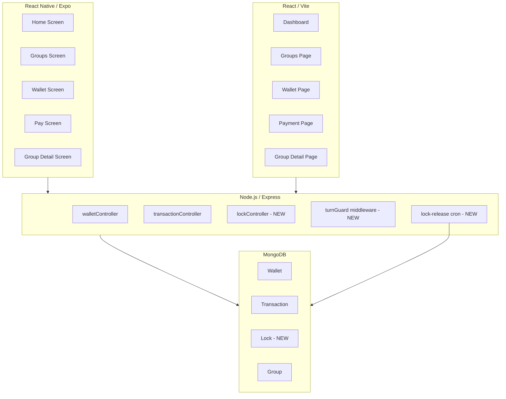

# Design Document: Web-Mobile Feature Parity

## Overview

This design covers 16 requirements that bring the Ajosave web (React/Vite) and mobile (React Native/Expo) platforms to full feature parity, wire up remaining stub/mock functionality to the real backend, enforce the turn-based contribution business rule, and introduce a new Wallet Lock feature on both platforms.

The work spans three layers:
- **Backend** — new endpoints, new Lock model, turn-guard middleware, CSV export, withdrawal endpoint
- **Web frontend** — replace mock data with real API calls, add missing UI features (filters, bank section, fund wallet, lock funds, payment method toggle, withdraw, export, auto-withdrawal)
- **Mobile frontend** — add missing UI features (upcoming contributions alert, due-now badge, progress bar, invitation card on group list, credibility badge, lock funds)

---

## Architecture



The backend follows the existing pattern: Express router → controller → Mongoose model. New functionality is added as new controllers/routes rather than modifying existing ones where possible, to minimise regression risk.

---

## Components and Interfaces

### Backend — New Endpoints

| Method | Path | Controller | Description |
|--------|------|-----------|-------------|
| POST | `/api/wallets/withdraw` | `walletController.withdraw` | Initiate withdrawal to linked bank |
| POST | `/api/wallets/auto-withdrawal` | `walletController.saveAutoWithdrawal` | Save auto-withdrawal settings |
| GET | `/api/transactions/export` | `transactionController.exportCSV` | Export transactions as CSV |
| POST | `/api/wallets/locks` | `lockController.createLock` | Create a wallet lock |
| GET | `/api/wallets/locks` | `lockController.getLocks` | List active locks |
| POST | `/api/wallets/locks/:lockId/unlock` | `lockController.unlock` | Manually unlock a lock |

Existing endpoints extended:
- `GET /api/transactions` — already supports `?groupId=` filter (confirmed in `transactionController.getTransactions`)
- `POST /api/transactions/contribution` — add turn-guard middleware
- `POST /api/transactions/contribution/wallet` — add turn-guard middleware

### Backend — Turn Guard Middleware

A new Express middleware `turnGuard` is inserted before both contribution endpoints. It reads the group's `membersList`, finds the entry for the requesting user, and checks whether `member.status === 'current'`. If not, it returns HTTP 403 with a message identifying the current turn holder.

```
turnGuard(req, res, next)
  → load Group by req.body.groupId
  → find membersList entry for req.user._id
  → if member.status !== 'current' → 403
  → else → next()
```

### Backend — Lock Release Cron

A `node-cron` job runs every hour (configurable). It queries `Lock.find({ status: 'active', releaseType: 'date', releaseDate: { $lte: new Date() } })` and for each expired lock calls the same release logic as the manual unlock endpoint, wrapped in a MongoDB session for atomicity.

### Frontend Services — Web

New methods added to `frontend/src/services/walletServices.js`:
- `withdraw(bankAccountId, amount)`
- `saveAutoWithdrawal(settings)`
- `initializeFunding(amount, email)` — already exists in backend, wire up
- `verifyFunding(reference)` — already exists in backend, wire up
- `createLock(amount, label, releaseType, releaseDate)`
- `getLocks()`
- `unlock(lockId)`

New method added to `frontend/src/services/api.js`:
- `getBlob(endpoint, params)` — for CSV download (returns raw Response for blob handling)

### Frontend Services — Mobile

New methods added to `mobile/services/walletService.ts`:
- `withdraw(bankAccountId, amount)`
- `createLock(amount, label, releaseType, releaseDate)`
- `getLocks()`
- `unlock(lockId)`

### Mobile — GroupsContext

The `GroupsContext` already provides `groups` array. The groups screen needs to render additional UI elements (invitation card, progress bar, credibility badge, due-now badge) using existing group data fields — no context changes needed.

### Mobile — WalletContext

Add `locks` state and `fetchLocks` / `refreshLocks` actions to `WalletContext`.

---

## Data Models

### Lock Model (new — `backend/src/models/Lock.js`)

```js
{
  userId:       ObjectId (ref: User, required, indexed)
  amount:       Number (required, min: 1)
  label:        String (optional, maxlength: 100)
  releaseType:  String (enum: ['date', 'manual'], required)
  releaseDate:  Date (required if releaseType === 'date')
  status:       String (enum: ['active', 'released'], default: 'active', indexed)
  createdAt:    Date
  releasedAt:   Date (set on release)
}
```

### Transaction Model — extended types

The existing `type` enum is extended to include `'lock'` and `'unlock'`:

```js
type: { enum: ['contribution', 'payout', 'withdrawal', 'fund_wallet', 'lock', 'unlock'] }
```

### Wallet Model — no schema changes needed

`availableBalance` and `lockedBalance` already exist. The lock/unlock operations use the existing `lockFunds()` and `unlockFunds()` instance methods.

### Group Model — turn tracking

The existing `membersList[].status` field (`'current' | 'pending' | 'completed' | 'missed'`) is used by the turn guard. No schema changes needed.

---

## Correctness Properties

*A property is a characteristic or behavior that should hold true across all valid executions of a system — essentially, a formal statement about what the system should do. Properties serve as the bridge between human-readable specifications and machine-verifiable correctness guarantees.*

### Property 1: Upcoming Contributions Alert Visibility

*For any* set of active groups, the Upcoming_Contributions_Alert banner is rendered if and only if at least one group has a `nextContribution` date within the next 7 days from the current time; if no such group exists, the banner is absent.

**Validates: Requirements 1.1, 1.4**

---

### Property 2: Upcoming Contributions Alert Content

*For any* set of groups with upcoming contributions, the rendered Upcoming_Contributions_Alert contains at most 3 entries, and each entry contains the group's name, contribution amount, and formatted due date.

**Validates: Requirements 1.2**

---

### Property 3: Due Now Badge Correctness

*For any* group card rendered in the Groups_List, the "Due Now" badge is present if and only if the group's `nextContribution` date is strictly before the current date.

**Validates: Requirements 2.1, 2.3**

---

### Property 4: Progress Bar Accuracy

*For any* group with `maxMembers > 0`, the progress bar fill percentage equals `Math.round((currentTurn ?? 0) / maxMembers * 100)`, and the label text contains the string `"${currentTurn ?? 0}/${maxMembers}"`.

**Validates: Requirements 3.1, 3.2, 3.3, 3.4**

---

### Property 5: Invitation Code Display

*For any* group card rendered in the Groups_List, the rendered card contains the group's `invitationCode` string.

**Validates: Requirements 4.1**

---

### Property 6: Credibility Badge Display

*For any* group card rendered in the Groups_List, the Credibility_Badge is present and shows `"{credibilityScore}%"` if and only if `credibilityScore` is a defined, non-null number.

**Validates: Requirements 5.1, 5.2**

---

### Property 7: Group History Transactions Completeness

*For any* `groupId`, all transactions returned by `GET /api/transactions?groupId=<id>` have `groupId` equal to the queried id, and the rendered History_Tab displays each transaction's type, amount, description, date, and status.

**Validates: Requirements 6.3, 6.6**

---

### Property 8: Withdrawal Balance Invariant

*For any* withdrawal of amount `X` where `X <= availableBalance`, after the withdrawal completes: `newAvailableBalance === oldAvailableBalance - X`, a withdrawal transaction record exists with `type === 'withdrawal'` and `amount === X`, and the web wallet page displays the updated balance.

**Validates: Requirements 7.3, 7.4, 7.5**

---

### Property 9: CSV Export Completeness

*For any* authenticated user, the CSV returned by `GET /api/transactions/export` contains one row for every transaction belonging to that user, with no rows belonging to other users.

**Validates: Requirements 8.2**

---

### Property 10: Auto-Withdrawal Settings Round Trip

*For any* valid auto-withdrawal configuration (bankAccount, percentage, minAmount, enabled), saving the settings via `POST /api/wallets/auto-withdrawal` and then fetching the wallet via `GET /api/wallets/me` returns the same configuration values.

**Validates: Requirements 9.2, 9.4**

---

### Property 11: Fund Wallet Balance Round Trip

*For any* successful Paystack funding of amount `X`, after verification: `newAvailableBalance === oldAvailableBalance + X`, and a `fund_wallet` transaction record exists with `amount === X`.

**Validates: Requirements 10.5, 10.6**

---

### Property 12: Transaction Filter Correctness

*For any* filter type `T` selected on the Wallet_Page (where `T ∈ {contribution, payout, withdrawal}`), every transaction displayed has `type === T`; when `T === 'all'`, all transactions are displayed.

**Validates: Requirements 11.2, 11.3**

---

### Property 13: Bank Account Section Completeness

*For any* set of linked bank accounts returned by `GET /api/wallets/bank-accounts`, every account appears in the Bank_Account_Section with its bank name, masked account number, account holder name, and Primary badge iff `isPrimary === true`.

**Validates: Requirements 12.1, 12.2**

---

### Property 14: Set Primary Bank Account Round Trip

*For any* bank account `A` in the user's linked accounts, after calling `PATCH /api/wallets/bank-accounts/A/set-primary`, exactly one account has `isPrimary === true` and it is account `A`.

**Validates: Requirements 12.4**

---

### Property 15: Wallet Page Real Data

*For any* authenticated user, the values displayed on the Wallet_Page for `availableBalance`, `lockedBalance`, `totalContributions`, and `totalPayouts` equal the corresponding fields in the response from `GET /api/wallets/me`.

**Validates: Requirements 13.1, 13.2, 13.3**

---

### Property 16: Wallet Payment Availability

*For any* selected group with contribution amount `C` and wallet `availableBalance` `B`: if `B < C`, the pay button is disabled and an insufficient balance warning is shown; if `B >= C`, the pay button is enabled. After a successful wallet payment, `newAvailableBalance === B - C`.

**Validates: Requirements 14.2, 14.4, 14.5**

---

### Property 17: Turn Guard Enforcement

*For any* contribution attempt (card or wallet) by user `U` for group `G`, the Backend rejects the request with HTTP 403 if and only if `U`'s entry in `G.membersList` does not have `status === 'current'`.

**Validates: Requirements 15.1, 15.2, 15.6**

---

### Property 18: Turn Indicator on Pay Screen

*For any* group card rendered on the Pay_Screen, the card displays a "Your Turn" indicator if and only if the current user's `membersList` entry for that group has `status === 'current'`, and the pay button is disabled when it is not the user's turn.

**Validates: Requirements 15.3, 15.4, 15.5**

---

### Property 19: Lock Balance Invariant

*For any* lock creation of amount `X` where `X <= availableBalance`: `newAvailableBalance === oldAvailableBalance - X`, `newLockedBalance === oldLockedBalance + X`, and `totalBalance` is unchanged. This invariant also holds in reverse for any lock release.

**Validates: Requirements 16.4, 16.5, 16.11**

---

### Property 20: Lock Release Round Trip

*For any* lock `L` with `releaseType === 'manual'`, after calling `POST /api/wallets/locks/L/unlock`: the lock's `status` is `'released'`, `availableBalance` is restored by `L.amount`, and an `unlock` transaction record exists. For a date-locked lock where `releaseDate > now`, the unlock attempt returns HTTP 403.

**Validates: Requirements 16.7, 16.8, 16.9**

---

### Property 21: Lock/Unlock Transaction Types

*For any* lock creation, the created Transaction record has `type === 'lock'`. For any lock release (manual or automatic), the created Transaction record has `type === 'unlock'`.

**Validates: Requirements 16.12**

---

## Error Handling

### Backend

- All new controllers use the existing `asyncErrorHandler` wrapper from `backend/src/middlewares/errorHandler.js`.
- `ValidationError` (400) is thrown for: amount exceeding balance, invalid lock amount, mismatched contribution amount, invalid auto-withdrawal settings.
- `NotFoundError` (404) is thrown for: lock not found, bank account not found, group not found.
- HTTP 403 is returned by the turn guard and by the date-lock early-unlock attempt.
- The lock release cron logs errors per-lock and continues processing remaining locks (fail-open per lock, not per batch).

### Web Frontend

- All API calls are wrapped in try/catch. Errors are surfaced via inline error banners (matching the existing pattern in `Dashboard.jsx`).
- Loading states use the existing `LoadingSpinner` component.
- The Wallet page uses a top-level `error` state that shows a retry button, consistent with `Dashboard.jsx`.

### Mobile Frontend

- All API calls follow the existing pattern in `WalletContext` and `GroupsContext`: set `error` state, display error banner with retry button.
- The lock creation form validates amount client-side before submitting.

---

## Testing Strategy

### Unit Tests

Unit tests cover specific examples, edge cases, and error conditions:

- Turn guard middleware: user is current turn → passes; user is not current turn → 403 with correct message
- Lock controller: amount > availableBalance → 400; date-locked unlock before releaseDate → 403
- CSV export: empty transaction list → valid CSV with headers only
- Auto-withdrawal settings: missing required fields → 400 validation error
- Withdrawal: amount = 0 → 400; amount = availableBalance (exact) → succeeds

### Property-Based Tests

Property-based tests use **fast-check** (JavaScript/TypeScript) for both backend and frontend logic. Each test runs a minimum of 100 iterations.

The property-based test suite is organized by feature. Each test is tagged with a comment referencing the design property it validates.

**Tag format:** `// Feature: web-mobile-feature-parity, Property {N}: {property_text}`

#### Backend property tests (`backend/src/__tests__/properties/`)

- **Property 1** — Generate random arrays of groups with random `nextContribution` dates; verify alert visibility logic.
- **Property 4** — Generate random `(currentTurn, maxMembers)` pairs; verify progress percentage and label computation.
- **Property 7** — Generate random transactions with mixed groupIds; verify filter returns only matching groupId.
- **Property 8** — Generate random `(availableBalance, withdrawalAmount)` pairs; verify balance invariant holds for valid amounts and rejection for invalid.
- **Property 9** — Generate random transaction sets for multiple users; verify CSV contains exactly the requesting user's transactions.
- **Property 10** — Generate random auto-withdrawal configs; verify round-trip save/fetch returns same values.
- **Property 11** — Generate random funding amounts; verify balance increases by exact amount after verification.
- **Property 12** — Generate random transaction lists with mixed types; verify filter correctness for each type.
- **Property 17** — Generate random group member lists with random `status` values; verify turn guard accepts only `'current'` status.
- **Property 19** — Generate random `(availableBalance, lockAmount)` pairs; verify balance invariant for lock/unlock.
- **Property 20** — Generate random locks with `releaseType === 'manual'`; verify round-trip lock/unlock restores balance.
- **Property 21** — Generate random lock/unlock operations; verify transaction type is always `'lock'` or `'unlock'` respectively.

#### Frontend property tests (`frontend/src/__tests__/properties/`)

- **Property 1** — Generate random group arrays; verify `computeUpcomingContributions()` helper returns correct groups.
- **Property 2** — Generate random upcoming contribution arrays (length 1–10); verify rendered alert shows at most 3 entries with required fields.
- **Property 3** — Generate random `nextContribution` dates; verify `isDueNow()` helper returns correct boolean.
- **Property 4** — Generate random `(currentTurn, maxMembers)` pairs; verify `computeProgress()` returns correct percentage.
- **Property 12** — Generate random transaction arrays and filter values; verify `filterTransactions()` helper returns only matching types.
- **Property 14** — Generate random `(availableBalance, contributionAmount)` pairs; verify `canPayFromWallet()` returns correct boolean.
- **Property 16** — Generate random wallet states and contribution amounts; verify pay button disabled state and balance-after computation.
- **Property 18** — Generate random member status values; verify turn indicator logic.

### Integration Tests

Integration tests (using supertest against a test MongoDB instance) cover the full request/response cycle for:
- `POST /api/wallets/withdraw` — happy path and insufficient balance
- `POST /api/wallets/locks` — happy path, insufficient balance, and lock list retrieval
- `POST /api/wallets/locks/:lockId/unlock` — manual unlock, date-locked early unlock rejection
- `GET /api/transactions/export` — CSV format and content
- Turn guard on both contribution endpoints
